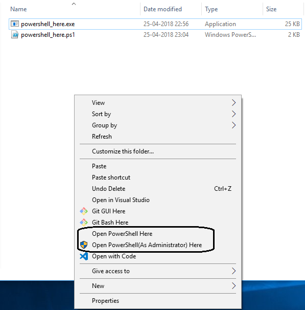

# PowerShell Here

A powershell script is created to provide easy right click context menu in folders, drives.

An exe is provided for quickly execute the same script. Make sure to run as administrator and make sure powershell ExecutionPolicy is set to RemoteSigned to execute the script.

In Powershell Elevated window :
Set-ExecutionPolicy -Scope Process RemoteSigned

Here is a screenshot:

